# Playwright Gmail API Test

Minimal setup for testing Gmail via API using Playwright and TypeScript.

## Installation

```bash
npm install
```

## Gmail API Setup

### 1. Create a project in Google Cloud Console

1. Go to https://console.cloud.google.com/
2. Create a new project (or select an existing one) 
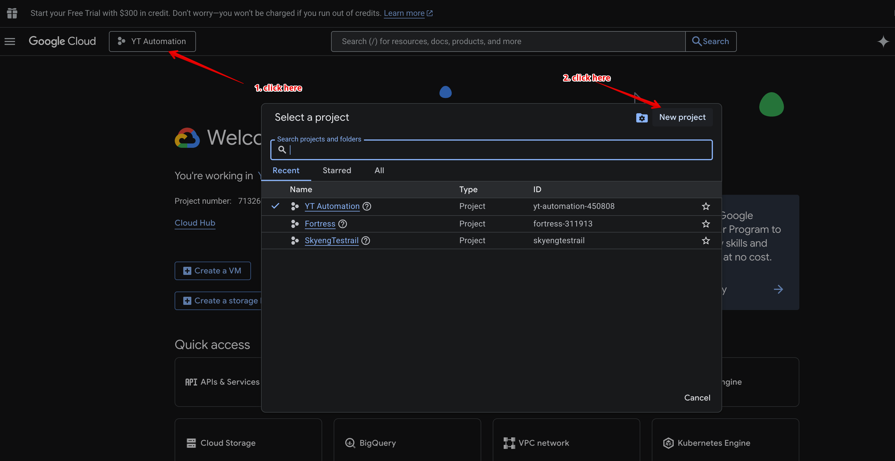

### 2. Enable Gmail API

1. In the left menu, select **APIs & Services** → **Library**
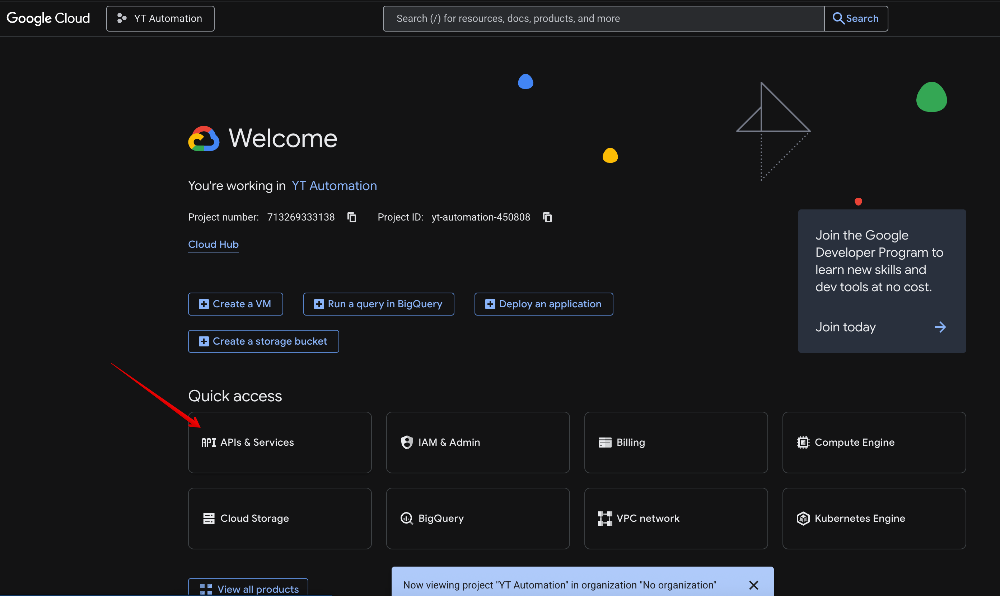
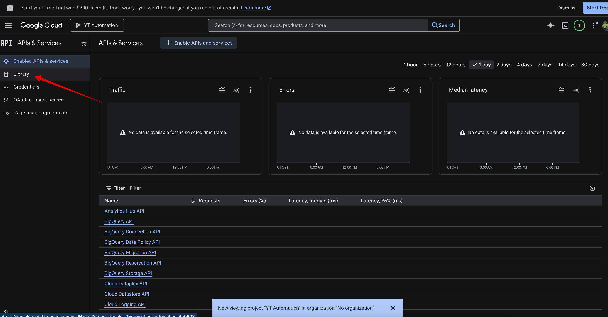
2. Search for **Gmail API**

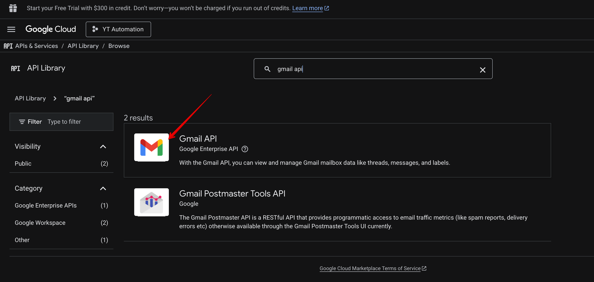
3. Click **Enable**
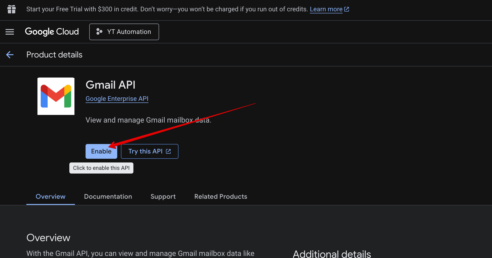

### 3. Create OAuth 2.0 credentials

1. Go to **APIs & Services** → **Credentials**
2. Click **Create Credentials** → **OAuth client ID**
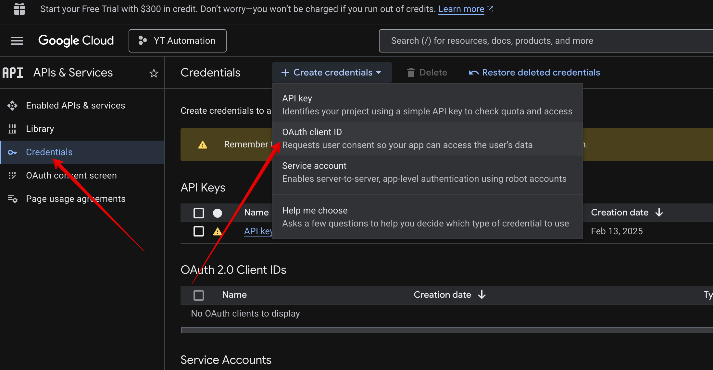
3. If prompted to configure OAuth consent screen:
   - Select **External**
   - Fill in the application name
   - Save
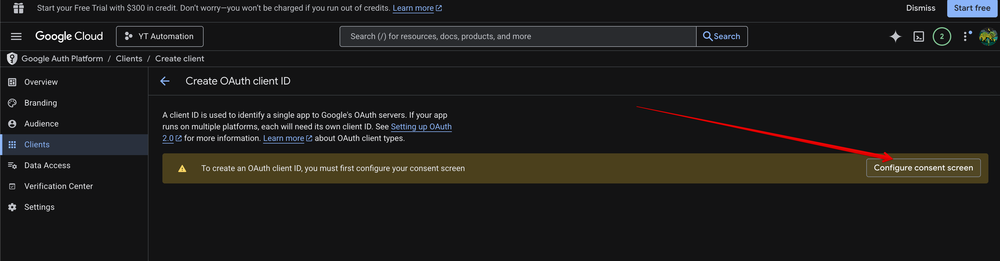
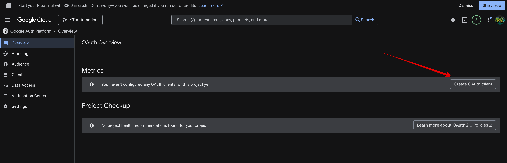
4. Select **Application type**: **Desktop app**
5. Give it a name (e.g., "Gmail Test")
6. Click **Create**

7. Download the JSON file and save it as `credentials.json` in the project root
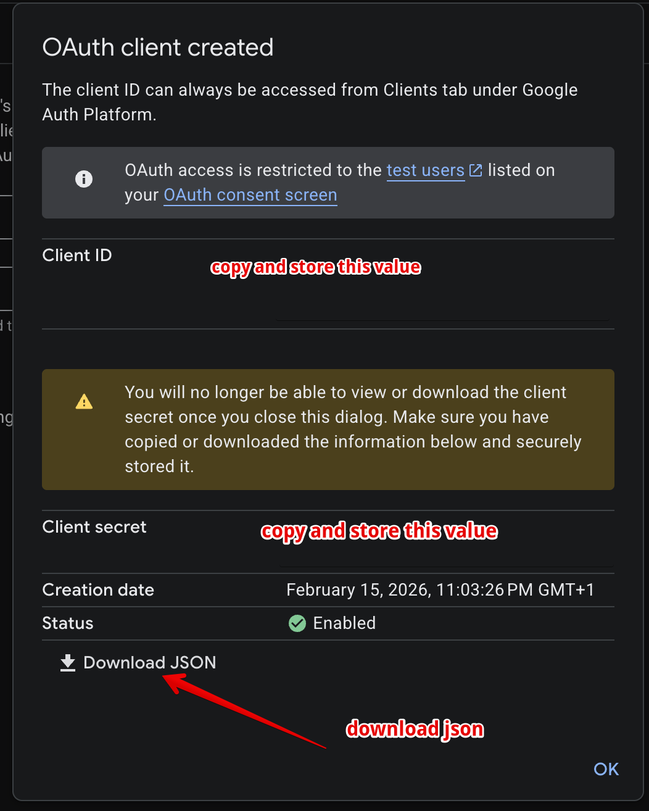
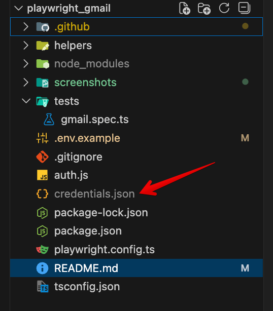
8. Go to **Test users** section and add your Gmail address that you'll use for testing (this is required to avoid "access_denied" error)
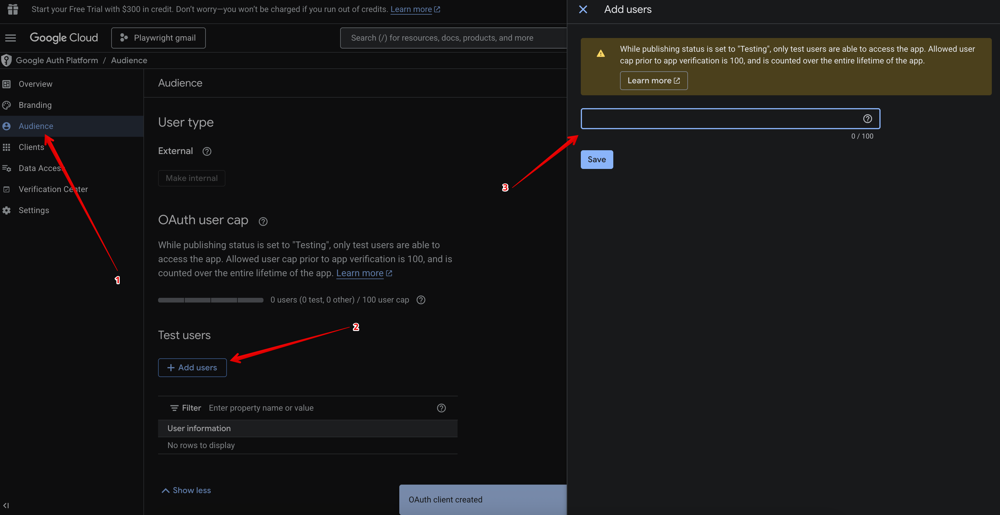

### 4. Get access token

Run the authorization script:

```bash
node auth.js
```

A browser will open, log in with your Gmail account and grant permissions. After that, a `token.json` file will be created.
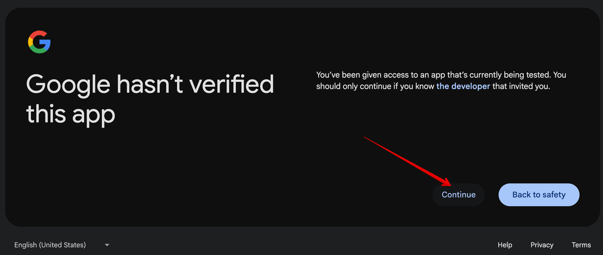
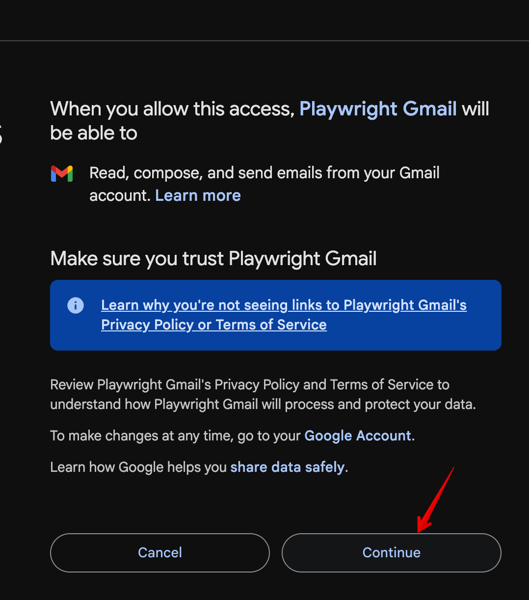

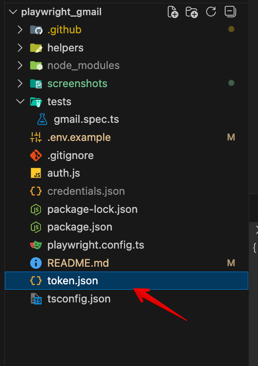

### 5. Configure email

Copy `.env.example` to `.env` and specify your Gmail address:

```bash
cp .env.example .env
```

Edit `.env`:
```
GMAIL_ADDRESS=your-email@gmail.com
```

## Run the test

```bash
npm test
```

## What the test does

1. Sends an email with test subject and body to the same Gmail address
2. Waits for the email via Gmail API
3. Verifies that the subject matches
4. Verifies that the body matches

IN CASE OF SUCCESS YOU SHOULD SEE SOMETHING LIKE THIS:
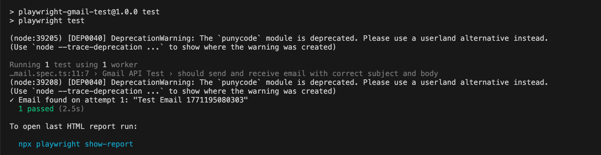